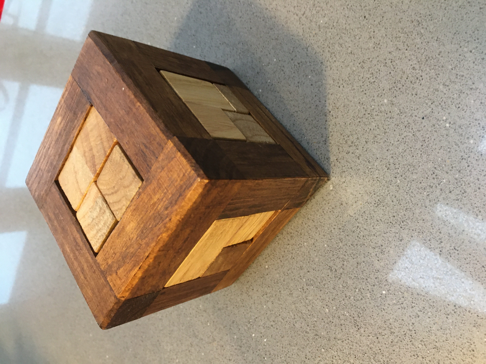
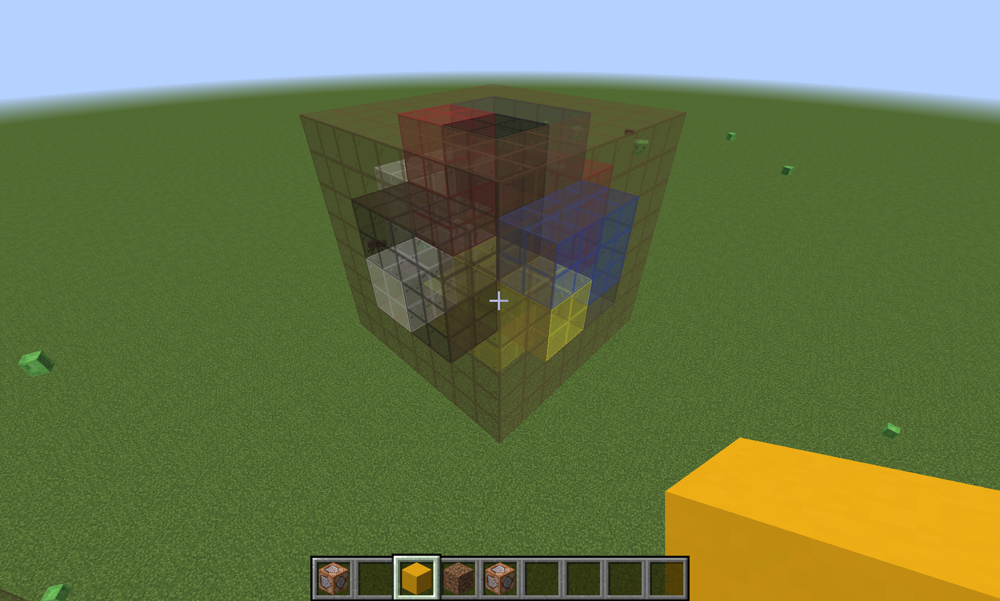

# Einstein Cube Solver

This little weekend project was about creating a program to solve a 3d cube.
I guess the code is far from optimal - I have not spent any time on that - it was fun to model a physical thing in code though.
The easiest way of displaying the solution in 3d was by using Minecraft. The output of the Solver is put into a datapack.
After generating a solution I used Minecraft to backtrack manually and figure out the order the pieces should be inserted.

